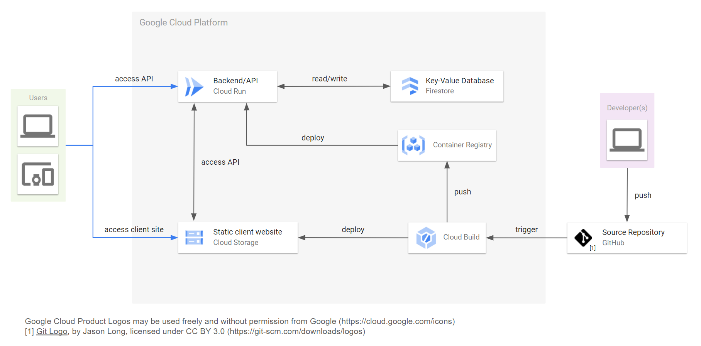

# url_shortener_gcp

URL shortener built using google cloud

## Architecture

## Server

the server exposes a REST-API with three possible requests:

- HTTP GET `/<key>` - redirect to original url or error page
- HTTP GET `/get/<key>` - get original url without redirect
- HTTP POST `/add` - add (url-encoded) url to the database

`server/` contains all the server code that is run in a stateless container on Cloud Run

To build the container, run `docker build -t <image-name> server/`

To run the container locally, download a service account key with permissions to access the firestore database into `server/firestore_service_acc.key.json` and run `./docker_run <image_name> "<docker_options>"`. This will inject the key into the image.

## Client

`client/` contains the static client website hosted through Cloud Storage

## Cloud Build

the configuration for Cloud Build can be found in `cloudbuild.yaml`
